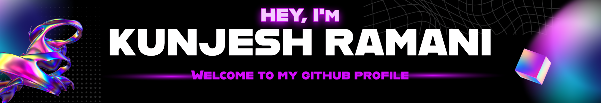

<div>
<h1 align="center"><b>A Computer Science Student</b></h1>
</div>


# <code>About Me</code>


- I have completed a ```Dipolma in Computer Programming``` course from Georgian College.
- My primary interests include Web Development, Python Programing, DSA, and Cloud Computing.
- I have earned 30+ globally recognized certifications from leading technology companies, including Oracle, Microsoft, AWS, Google Cloud, GitHub, and CompTIA.
- In my leisure time, I try to indulge in tech-related books.
# 💻<code>Tech Stack</code>


<div align="left">

## Programming Languages and Frameworks


  
  
  
  
  
  
  
    
  
  
  
  
    
  
  
  

## Web Development


  
  
  
  
  


  
  
  


## Databases

 
  
  
  

## Version Control Systems

   
    
    
  
   

## Cloud Platforms

    
    
    


## Tools and IDEs


 
  
  

  
  
  
  
  
  
  
  

<!-- <div style="display: inline_block"><br> -->
  
</div>
<br>

<div align="center">

# 📊<code>GitHub Stats</code>

</div>

<div align='center'>

   <a href="https://github.com/alsiam"></a>

   <a> </a>

  <a href="https://github.com/KunjeshRamani"> </a>
  </br></br>
  <a href="https://github.com/KunjeshRamani"></a>

  <!-- <a href="https://github.com/Kunjesh9867"></a> -->
</div>

<!--

-->

<!-- <div align='center'> </div> -->
<h1 align="center">Thanks for Visiting my GitHub Profile!</h1>
<p align="center"></p>


